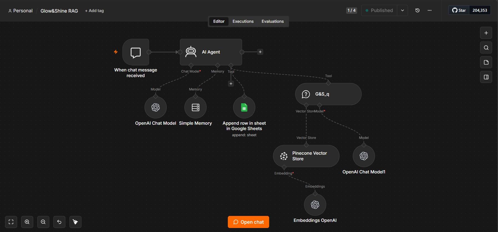
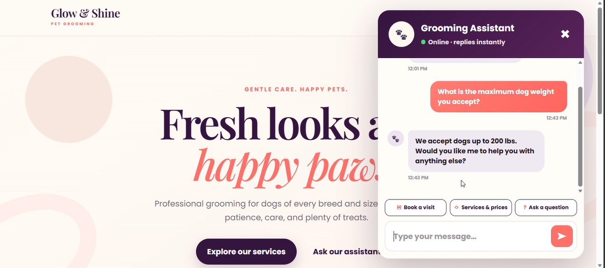
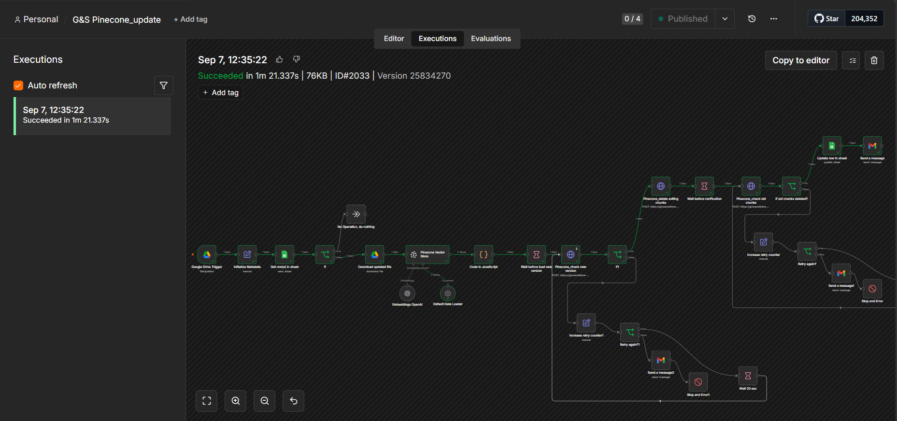
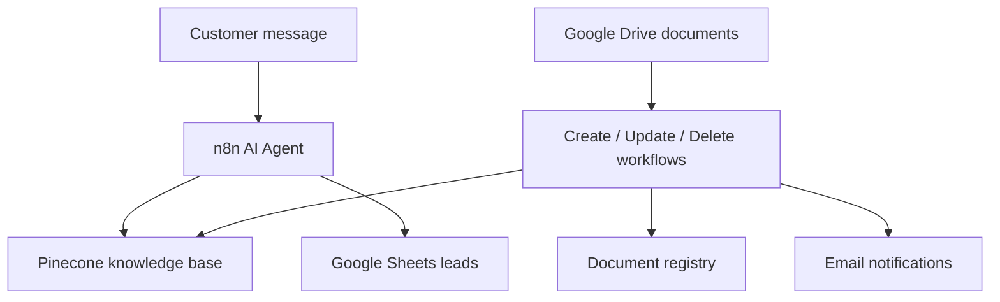

# n8n RAG Chatbot for a Grooming Salon

An AI-powered customer support chatbot built in n8n. It answers questions from a Pinecone knowledge base, captures leads in Google Sheets, and automatically synchronizes business documents stored in Google Drive.

## Watch the demo

See the chatbot answer a customer question, update its knowledge base after a Google Drive document changes, and answer the same question with the new information.

▶️ [Watch the video demonstration](https://github.com/putilovaa/n8n-rag-grooming-chatbot/releases/tag/v1.0.0)

## Project preview

### RAG chatbot workflow

### Customer-facing chatbot

### Automated knowledge base update

> Portfolio project: all credentials, account identifiers, email addresses, and service URLs have been removed or replaced with placeholders.

## What this project solves

The salon needs a chatbot that can answer common customer questions while keeping its knowledge base synchronized with business documents. Staff can add, edit, or remove a document in Google Drive without manually rebuilding the vector database.

## Key features

- RAG-based answers grounded in salon documents
- Lead capture to Google Sheets
- Automatic ingestion of new Google Drive documents
- Version-aware document updates
- Safe removal of outdated Pinecone chunks
- Detection and cleanup of deleted documents
- Retry and verification logic for Pinecone operations
- Success, warning, and failure notifications by email
- Conversation memory for follow-up questions

## Architecture

## Included workflows

| File | Purpose |
| --- | --- |
| `01-rag-chatbot.json` | Answers customer questions and captures leads |
| `02-create-documents.json` | Adds new documents and registers their metadata |
| `03-update-documents.json` | Loads a new version, verifies it, and removes old chunks |
| `04-delete-documents.json` | Detects removed Drive files and deletes their Pinecone chunks |

## Technology stack

- n8n (self-hosted)
- OpenAI chat model and embeddings
- Pinecone vector database
- Google Drive
- Google Sheets
- Gmail
- JavaScript in n8n Code nodes

## Reliability design

Each document is tracked using a document ID and an active version ID. During an update, the new version is loaded and verified before the previous version is deleted. Retry counters, wait steps, conditional checks, and error branches reduce the risk of losing an active document during synchronization.

## Setup

1. Import the four JSON workflow files from this repository into n8n.
2. Create and select your own OpenAI, Pinecone, Google Drive, Google Sheets, and Gmail credentials.
3. In n8n, create a **Header Auth** credential for Pinecone HTTP requests:
   - Name: `Api-Key`
   - Value: your Pinecone API key
4. Replace the placeholders in the imported workflows:
   - `YOUR_PINECONE_INDEX_NAME`
   - `YOUR_PINECONE_INDEX_HOST`
   - `YOUR_GOOGLE_DRIVE_FOLDER_ID`
   - `YOUR_DOCUMENT_REGISTRY_SHEET_ID`
   - `YOUR_LEADS_SHEET_ID`
   - `your-email@example.com`
5. Create the Google Sheets tables referenced by the workflows:

   **Document registry**

   `document_id`, `document_name`, `namespace`, `source`, `status`, `last_synced_at`, `file_modified_time`, `chunks_count`, `active_version_id`

   **Lead capture**

   `name`, `phone`, `email`, `interested in`

6. Test each workflow manually before activating its trigger.

## Security

Secrets are not stored directly in the shared workflow files. API keys and OAuth access should be configured through n8n Credentials. Never commit production credentials, webhook URLs, customer data, or exported execution data to a public repository.

## Project status

Completed portfolio case study. The workflows were tested with simultaneous document updates, version replacement, deletion checks, Pinecone verification, and email status notifications.

## Author

Anastasiia Putilova  
n8n Automation | AI Workflows, RAG Chatbots & API Integrations
